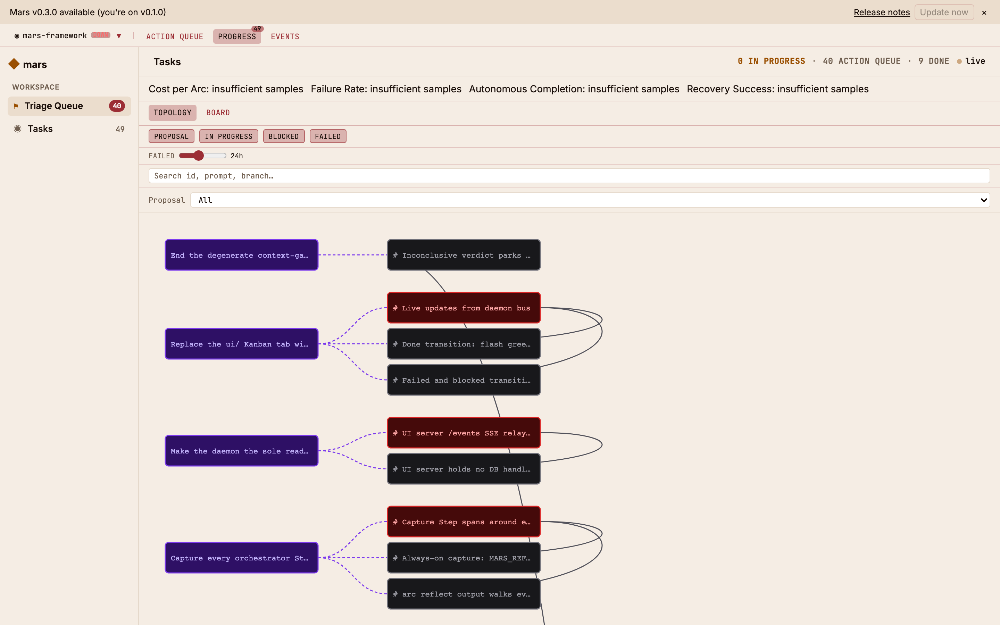
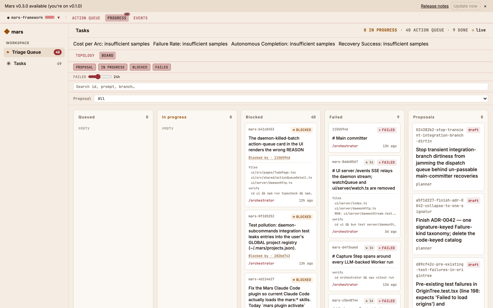
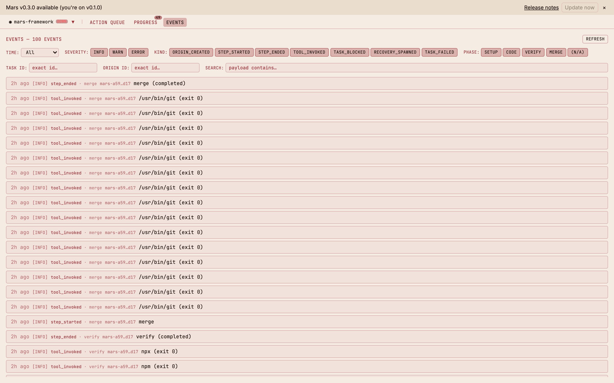
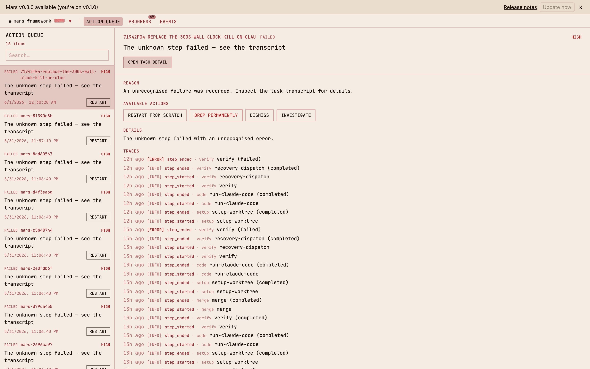

<div align="center">

# Mars

**An AFK agent team for your repo — on your laptop, on your Claude subscription.**

Mars runs Claude Code as a fleet of parallel workers against a single repo:
each task gets its own git worktree, gets coded, verified, and merged — while
you do something else. No servers to stand up. No API keys. No per-token bill.

[Why Mars](#why-mars) · [How it works](#how-it-works) · [Quick start](#quick-start) · [The UI](#the-ui) · [Vision](./VISION.md) · [CLI reference](./orchestrator/README.md)

</div>

---



## Why Mars

**A real agent team, zero infrastructure.** Queue work and walk away.
A local daemon picks up tasks, spawns a Claude Code worker per task in
its own isolated git worktree, runs them in parallel, verifies each
(typecheck → test → lint), and fast-forwards the passing ones into your
branch. Merge conflicts go to a dedicated reconciler agent. It feels like
a managed agent platform — but it's a single CLI and a SQLite file next to
your project. Nothing to deploy, nothing to log into, nothing in the cloud.

**Your subscription, not an API bill.** Every model call shells out to your
authenticated `claude` CLI. There are no provider SDKs and no API keys
anywhere in Mars — so a long AFK session draws on the Claude subscription
you already pay for instead of metering you per token.

**Token usage that doesn't burn out in an hour.** Mars routes each role to
the cheapest model that can do the job — Haiku for routine writing, Sonnet
for coding, Opus only where architectural reasoning earns it. The
human-facing surface is a CLI, not a chat transcript, so orchestration
state stays out of the context window instead of bloating it.
→ *[Read: designing Mars around a CLI surface to save context](#) (article coming soon)*

## What Mars is

> Mars is a personal AI coding orchestrator. One person runs a small AI
> engineering team on their own laptop, against their own repo, with the full
> audit trail in a local SQLite file they can `cat`, `grep`, and back up like
> any other file.

It is **not** a managed runtime. There's no hosted control plane, no
multi-tenant queue, no telemetry. What happens on the laptop stays on the
laptop. See [`VISION.md`](./VISION.md) for the full target state and non-goals,
and [`ARCHITECTURE.md`](./ARCHITECTURE.md) for what exists today.

Mars gives you the *plumbing* — worktree isolation, parallel dispatch,
verification gates, serialized merges, persistence, an audit log — so you
can compose your own workflow on top of it instead of building any of that
yourself.

## How it works

You drop work into a queue; the daemon turns it into merged commits.

```
  mars task add "<prompt>"
            │
            ▼
     mars.db (status=queued) ──► daemon claims it
            │
            ▼
  ┌──────────────────────────────────────────────────────┐
  │  1. setup    git worktree on task/<id> off your branch │
  │  2. code     claude -p  (parallel across tasks)        │
  │  3. verify   typecheck → test → lint   (fail-fast)     │
  │  4. merge    serialized via file lock → fast-forward   │
  │              conflict → reconciler agent ("Vega")      │
  └──────────────────────────────────────────────────────┘
            │
            ▼
   done  (worktree removed)   |   failed  (kept for triage)
```

- **Coding is unlimited-parallel; merging is serialized** by a file lock, so
  many workers run at once but the integration branch is never raced.
- **Persistence across restarts.** State lives in SQLite (`.mars/`), and every
  run writes a journal — so stopping the daemon, restarting it, or recovering
  from a crash resumes cleanly instead of losing or double-running work.
- **Clear visualization & event handling.** A read-only UI streams every step
  live (see below); a single **action queue** is the one place anything that
  needs *you* shows up — a failed task, a stuck blocker, a draft to shape.

For fuzzy work, there's a shaping lane (`mars idea add` → grill → slice into
tasks) that turns a one-line goal into a wired dependency graph of tracer-bullet
tasks. Both lanes end at the same dispatcher above.

## Quick start

```sh
# 1 — install the mars CLI (once per machine; re-run to upgrade)
curl -sSL https://github.com/ilies-bel/mars/releases/latest/download/get-mars.sh | bash

# 2 — inside your repo: scaffold state + activate the mars:* skills
mars init

# 3 — add work and watch it run
mars task add "implement X in src/foo.ts"   # daemon auto-spawns on first write
mars list                                    # see live statuses
mars ui                                       # open the dashboard
```

**Requirements:** `git`, the authenticated
[Claude Code](https://docs.claude.com/en/docs/claude-code) CLI on `PATH`
(every model call shells out to `claude -p` — no API keys), and Bun (the
installer adds it if missing). The full command surface, env vars, and
status machine live in [`orchestrator/README.md`](./orchestrator/README.md).

## The UI

`mars ui` opens a read-only dashboard (`http://127.0.0.1:7777`) that streams
live from `.mars/`. The CLI is the only write surface — the UI never mutates
state.

| Topology — the live dependency graph | Board — the AFK team at work |
| :---: | :---: |
|  |  |
| **Events — the full audit trail** | **Action queue — what needs you** |
|  |  |

- **Topology** — every task and proposal as a node, with blocker edges drawn
  between them, over a KPI strip (cost per arc, failure rate, recovery success).
- **Board** — a Kanban of Queued / In progress / Blocked / Failed / Proposals.
- **Events** — every `step_started` / `tool_invoked` / `step_ended`, filterable
  by severity, kind, and task — the audit trail, live.
- **Action queue** — the human-attention surface: pick a row, read the failure
  reason and full transcript, and resolve it (restart, drop, investigate).

## Documentation

- [`VISION.md`](./VISION.md) — what Mars is, the canonical loop, non-goals.
- [`ARCHITECTURE.md`](./ARCHITECTURE.md) — components and state as they exist today.
- [`orchestrator/README.md`](./orchestrator/README.md) — full CLI reference and
  workflow internals (commands, env vars, A/B, reflection, daemon).
- [`CONTEXT.md`](./CONTEXT.md) — domain glossary (edit via `mars glossary` only).
- [`docs/adr/`](./docs/adr/) — Architecture Decision Records (add via `mars adr` only).

## License

MIT — see [`LICENSE`](./LICENSE).
