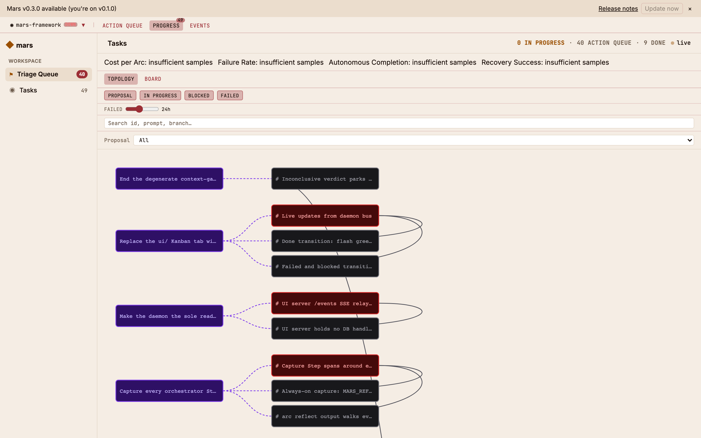
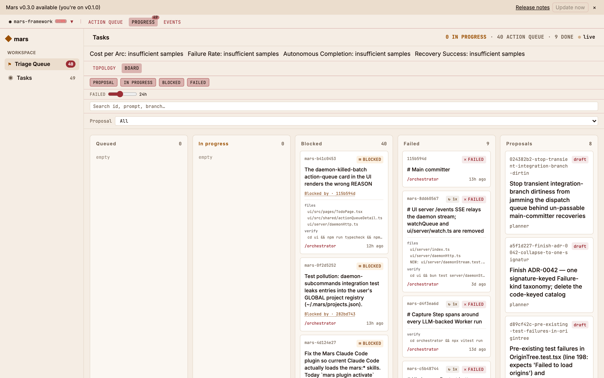
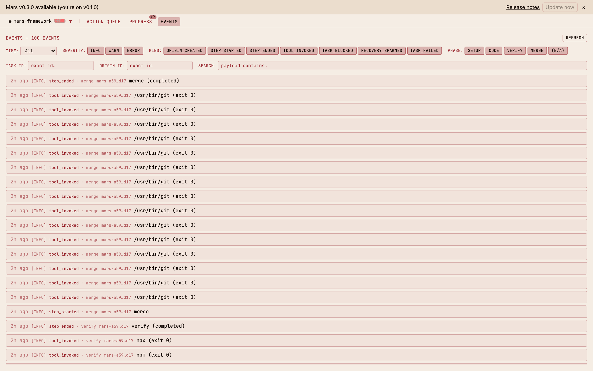
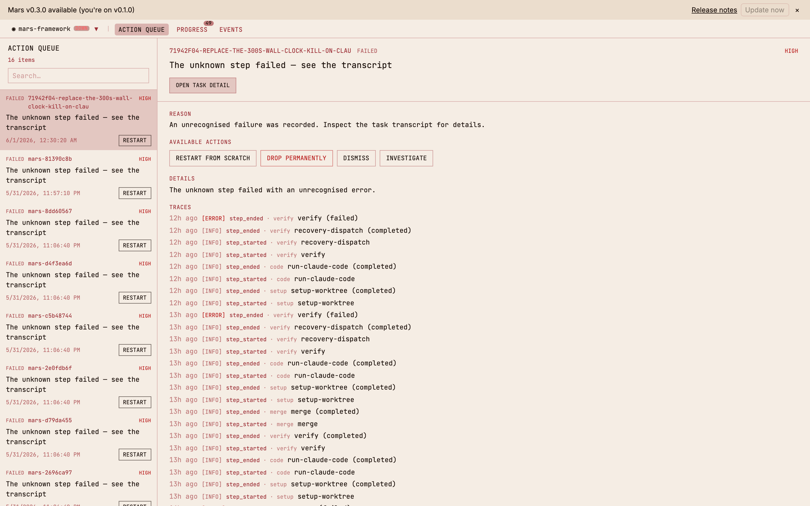

<div align="center">

# Mars

**Cursor for engineers.**

Vibe coding traded your control for speed. Mars gives you the speed and keeps
the control.

[The problem](#the-problem) · [Quick start](#quick-start) · [Control](#control--the-pillar-that-matters) · [How it works](#how-it-works) · [The UI](#the-ui) · [CLI reference](./orchestrator/README.md)

</div>

---

<!-- TODO: replace with a 60-90s hero demo video showing the full loop:
     mars task add → daemon picks up → workers coding in parallel → verify → merge → done
     Record with: mars task add "add a /healthz endpoint to server.ts"
                  + mars list (show statuses ticking)
                  + mars ui (show board updating live)
     Host on YouTube/Vimeo and embed here. -->



## The problem

Vibe coding works. That's the trap. You ship fast for three weeks and then
you're maintaining a codebase you did not author — you approved diffs you
skimmed, there's no record of why anything is the way it is, and the same
concept has three names in four files because every session started from
zero. The failure mode isn't bad code; modern agents write fine code. It's
**lost authority** — you stopped being the engineer and became the approve
button. The tools built for this optimise for accepting suggestions faster:
a diff in front of you, asking you to say yes. Mars asks a different
question: what would it take to let agents write most of your code and
still be the engineer at the end of it?

## Quick start

```sh
# 1 — install the mars CLI (once per machine; re-run to upgrade)
curl -sSL https://github.com/ilies-bel/mars/releases/latest/download/get-mars.sh | bash

# 2 — inside your repo: scaffold state + activate the mars:* skills
mars init

# 3 — add work and watch it run
mars task add "implement X in src/foo.ts"   # daemon auto-spawns on first write
mars list                                    # see live statuses
mars ui                                      # open the dashboard
```

**Requirements:** `git`, Node >= 22.13, and an authenticated agent CLI on
`PATH`. The default is Codex: install `codex`, then run `codex login` once.
Use `mars init --provider claude` or `--provider gemini` to select another
adapter.

<!-- TODO: record a 30s terminal screencast of the quick-start flow above.
     Tool suggestion: asciinema or vhs (https://github.com/charmbracelet/vhs)
     Host the .gif or .svg in docs/assets/quickstart.* -->

## Control — the pillar that matters

Agents still write the code. Every unit of work passes an engineer's
controls on the way in and on the way out.

| Control | Mechanism | Proof |
| --- | --- | --- |
| A spec before code | `--files` / `--verify` / `--done` produce a typed spec; the implementor gets it as a checklist. The grill shapes fuzzy work into a PRD before a line is written. | `mars task add --help` |
| A gate, not a vibe | typecheck → test → lint, fail-fast. Green merges. Nothing else does. | `orchestrator/src/tools/verify/` |
| A defended vocabulary | The glossary is editable only through `mars glossary` and is read by every Worker. | `CONTEXT.md`, `orchestrator/src/cli/commands/glossary.ts` |
| Defended decisions | ADRs — the trade-offs you already settled don't get re-litigated by an agent at 2am. | `docs/knowledge/decisions/` — 94 of them |
| A record that survives | Every arc in local Postgres. "Why is this line here" has an answer six months later. | `psql "$(cat .mars/pg.dsn)"` |
| Your branch is never raced | Merges serialize behind a file lock and fast-forward. A merge that finds a dirty tree it can't attribute commits it to a checkpoint ref rather than cleaning it. | `orchestrator/src/tools/merge/`, `orchestrator/src/core/lib/git/checkpoint.ts` |
| Decisions, not diffs | The action queue surfaces what a machine genuinely cannot decide. You are not a rubber stamp on a diff queue. | `mars action-queue list` |
| Bounded flailing | Exactly one recovery attempt per failure. Then it stops and asks you. No retry budget, no tunable knob. | ADR-0040 |

Cursor asks you to approve a diff. Mars asks you to approve a decision — and
only when there is genuinely one to make.

## It grows into your repo

An independent survey of nine open-source orchestrators named this as the
gap the entire category has:

> "OSS orchestrators lack **learning persistence** … No tool here maintains
> reusable, improved agent configurations across sessions automatically."
> — Augment Code, 2026

Mars ships opinionated and then bends toward you:

| Your input | What Mars keeps | Where |
| --- | --- | --- |
| A failure it has never seen | An Investigator writes a recovery recipe, so the second time is automatic | `orchestrator/src/init/recipes-seed.ts`, `orchestrator/src/outbox/subscribers/recovery-spawn.ts` |
| Friction that recurs across tasks | A draft proposal for a new step in your workflow | `orchestrator/src/growth/step-suggestions.ts`, `orchestrator/src/growth/heuristics.ts` |
| Terms you sharpened in the grill | A glossary every future Worker reads | `CONTEXT.md` |
| Your Workers' measured performance | Rewritten prompt blocks, in a revertible ledger | `orchestrator/src/core/steward-prompt-optimizer.ts`, `orchestrator/src/core/steward-ledger.ts` |
| Your habits | A notice — with the off-switch attached to the message | `orchestrator/src/core/levers/store.ts` |

`orchestrator/src/growth/step-suggestions.ts:2` calls itself *"the 'grow with
the user' surface."* That's not marketing language retrofitted onto code;
the code said it first.

Ships with opinions. After a month, they're yours.

## Event-driven and traced

Not a buzzword — a transactional outbox and a span per step. Together
they're why the state you're shown is never a lie, and why every line of
code in your repo has a paper trail leading back to the decision that
caused it.

**Event-driven:** the outbox (`orchestrator/src/outbox/`) is an `events`
table, named subscribers, and a cursor that advances only when the handler
succeeds — a crash mid-delivery replays, it never silently drops. Sixteen
subscribers each own one consequence (`blocker-resolution`, `recovery-spawn`,
`steward-runtime-tune`, `desktop-notify`, `transcript-append`, …); adding a
consequence is a new subscriber, not a new branch in a god function. The
dispatcher doubles as the spend throttle — it enforces the per-kind ceiling
returned by the spend-control decision (`orchestrator/src/outbox/dispatcher.ts`).
Out to the UI, `GET /view/stream` sends payload-free typed invalidation pings
(`orchestrator/src/core/daemon/view/stream-hub.ts`) — the client learns a view
changed and re-fetches, never a stale copy of state. And what needs no event
at all: condition rows in the action queue are derived on read, a pure
projection of entity state (ADR-0048) — a condition that does not hold is
unrepresentable, so stale alerts cannot accumulate.

**Traced:** every step is bracketed by a span, not just the model calls.
`run-worker-with-span.ts` wraps LLM-backed Workers with the worker name,
provider session id, token usage, and transcript; `runNonLlmStepWithSpan`
wraps setup, verify, and merge the same way. The split is an enforced
invariant, not a convention: *a Step span is a Session iff `worker IS NOT
NULL`* (`orchestrator/src/core/lib/run-worker-with-span.ts`). It's your
database — 77 tables, queryable with `psql "$(cat .mars/pg.dsn)"`, no
vendor, no retention policy, no 30-day dashboard cutoff
(`orchestrator/src/core/lib/pg-schema.ts`).

Every commit traces back to the decision that caused it — and the database
is on your disk.

## Lean on tokens

Most agent tools spend your budget on coordination. Mars is unusual in
metering itself. Narration is deliberately kept outside the paid provider
boundary — the situation report that opens a subthread is built from reads
of the daemon's own stores, not a model call
(`orchestrator/src/core/lib/situation-report.ts`). Worker roles route through
semantic model tiers so routine judging doesn't run at flagship prices. Mars
watches its own spend (`orchestrator/src/core/daemon/usage-sampler.ts` →
`orchestrator/src/core/lib/notices/token-spend-trend.ts`) and compares the
recent window against the one before it, and can pause dispatch outright on
a provider quota rejection rather than quietly burning down your month. The
`economize` skill (`.claude/skills/economize/`) targets 60-90% token
reduction on typical sessions by routing you to codegraph and file ranges
instead of grep+Read loops.

The only agent orchestrator that tells you it's getting expensive.

## Everything is swappable — except one thing

The container **is** [cordis 4](https://www.npmjs.com/package/@deepseek-ai/cordis)
(`@deepseek-ai/cordis@4.0.1` in `orchestrator/package.json`) — a real
`Context`, a real `Fiber`, a real typed event bus, not a bespoke plugin
system you have to learn. Swap a coder, a verify heuristic, a merge
strategy, a provider, or a single workflow step from a
`.mars/workflows/*.js` file — everything ships wired, so swapping is
opt-in, never setup. One thing is sealed: `store` and `traceStore` are
installed as cordis *accessors*, not services, so `ctx.provide('store', …)`
throws — and the seal holds even under `ctx.isolate` (ADR-0052,
`orchestrator/src/core/__tests__/sealed-write-funnel-guard.test.ts`).

You can change what runs. You can never change whether it was recorded.

## How it works

You drop work into a queue; the daemon turns it into merged commits.

```
  mars task add "<prompt>"
            │
            ▼
     tasks row (status=queued) ──► daemon claims it
            │
            ▼
  ┌──────────────────────────────────────────────────────┐
  │  1. setup    git worktree on task/<id> off main       │
  │  2. code     selected agent CLI  (parallel)           │
  │  3. verify   typecheck → test → lint  (fail-fast)     │
  │  4. merge    serialized via file lock → fast-forward   │
  │              conflict → reconciler agent ("Vega")      │
  └──────────────────────────────────────────────────────┘
            │
            ▼
   done  (worktree removed)   |   failed  (kept for triage)
```

- **Coding is unlimited-parallel; merging is serialized** by a file lock, so
  many workers run at once but the integration branch is never raced.
- **Persistence across restarts.** State lives in an embedded Postgres
  database (`.mars/`), and every run writes a journal — so stopping the
  daemon, restarting it, or recovering from a crash resumes cleanly instead of
  losing or double-running work.
- **Self-healing.** When a task fails, the orchestrator spawns one recovery
  task to fix it. Recovery recipes match known failure signatures to targeted
  prompts. Unknown failures trigger an Investigator agent that proposes a
  recipe for next time.

For fuzzy work, there's a shaping lane (`mars proposal add` → grill → slice
into tasks) that turns a one-line goal into a wired dependency graph of tasks.
Both lanes end at the same dispatcher above.

## Compared to Bernstein

Bernstein is the nearest architectural neighbour — same planning-to-merge
pipeline, per-task worktrees, verify-then-merge. No model in its coordination
loop, byte-identical replay, an HMAC audit chain, 40+ adapters. It wins on
determinism.

| | Bernstein | Mars |
| --- | --- | --- |
| Optimises for | Reproducibility | Adaptation |
| Ideal end state | Run #500 ≡ run #1 | Run #500 is nothing like run #1 |
| Buyer | A compliance reviewer | One engineer and their repo |

A tool that replays byte-identically cannot grow into your repo. That's the
trade; Mars took the other side.

## Features

### Parallel task execution

Queue multiple tasks and Mars runs them simultaneously, each in its own
isolated git worktree. No stepping on each other's files, no manual branch
juggling.

```sh
mars task add "add input validation to the signup form"
mars task add "write unit tests for the billing module"
mars task add "refactor the auth middleware to use JWT"
# all three run in parallel — watch them on the board
mars ui
```

<!-- TODO: record video showing 3+ tasks running in parallel on the board view.
     Show tasks moving through queued → running → verifying → done.
     Host: docs/assets/demo-parallel.mp4 -->

### Task dependencies with blockers

Wire tasks into dependency chains. Blocked tasks wait until their prerequisites
merge, then auto-promote to the queue.

```sh
mars task add "define the User schema in src/models/user.ts" --tag coder
# capture the id from the output, e.g. abc123
mars task add "add CRUD endpoints for users" --blocked-by abc123
mars task add "write integration tests for user endpoints" --blocked-by abc123
```

<!-- TODO: record video showing blocker resolution: task A finishes, tasks B and C
     auto-promote from blocked → queued → running.
     Show the topology view with edges between them.
     Host: docs/assets/demo-blockers.mp4 -->

### Proposal shaping (the grill)

For fuzzy ideas that aren't ready for code yet: shape them into precise PRDs
through an adversarial grilling session, then slice into an execution plan.

```sh
mars proposal add "add real-time notifications to the app"
# then in Claude Code:
/mars:grill
# the grill challenges your spec, sharpens terminology,
# and outputs a structured PRD that slices into concrete tasks
```

<!-- TODO: record video of a /mars:grill session: show the back-and-forth where
     the grill challenges vague terms and refines the spec.
     Host: docs/assets/demo-grill.mp4 -->

### Self-healing and recovery

When a task fails verification, Mars doesn't just stop. It spawns a targeted
recovery task with the failure context, fixes the issue, and re-verifies.
Known failure patterns get matched to recovery recipes for faster resolution.

<!-- TODO: record video of a task failing verify (e.g., a type error),
     the orchestrator spawning a fix task, and the fix landing.
     Show the action queue alert appearing and resolving.
     Host: docs/assets/demo-recovery.mp4 -->

### Merge conflict reconciliation (Vega)

When parallel tasks touch overlapping files, Mars doesn't bail — it dispatches
the conflict to Vega, a dedicated reconciler agent that understands both sides
and merges intent, not just text.

<!-- TODO: record video of two tasks touching the same file, the merge step
     detecting a conflict, and Vega reconciling it.
     Host: docs/assets/demo-vega.mp4 -->

### Structured tasks

Give the agent clear guardrails: specify which files to touch, how to verify,
and what "done" looks like.

```sh
mars task add "migrate the config loader from YAML to TOML" \
  --files "src/config.ts,src/config.test.ts" \
  --verify "npm test -- --grep config" \
  --done "all tests pass, no YAML imports remain" \
  --priority 2
```

### Worker model routing

Each role runs on the right semantic model tier. With the default Codex
provider, those tiers resolve as follows:

| Worker | Default model | Role |
| --- | --- | --- |
| Coder / Fixer | `gpt-5.6-terra` | Implementation and scoped recovery |
| Planner / Slicer | `gpt-5.6-sol` | Architectural reasoning |
| Triager / Behaviour Verifier | `gpt-5.6-terra` | Classification and behavioural checks |
| Scorer | `gpt-5.6-luna` | Routine judging |
| Rescue Operator | `gpt-5.6-terra` | Targeted recovery |

Override the Coder model for one daemon run:
`MARS_WORKER_MODEL=gpt-5.6-sol mars daemon start`.

### Claude Code skills

Mars installs a set of `/mars:*` slash commands into your Claude Code session:

| Command | What it does |
| --- | --- |
| `/mars:chat` | Triage entry point — classifies your input and routes to the right sub-skill |
| `/mars:task` | Quick-enqueue with terminology check |
| `/mars:grill` | Adversarial PRD shaping session |
| `/mars:action-queue` | Show everything that needs you |
| `/mars:alerts` | Failed tasks and stale worktrees |
| `/mars:unblock` | Diagnose and unblock a stuck task |
| `/mars:diagnose` | Post-mortem a failed task |
| `/mars:live` | Drive a manual-step task through its checklist |
| `/mars:reflect` | Synthesize improvement proposals from completed work |
| `/mars:deep-reflect` | Transcript-level post-mortem on a full arc |

## The UI

`mars ui` opens a read-only dashboard that streams live from the daemon. The
CLI is the only write surface — the UI never mutates state.

<!-- TODO: record a 45-60s walkthrough video of the UI:
     1. Open mars ui, show the topology view with tasks and edges
     2. Switch to the board tab, show tasks in columns
     3. Click into a task, show the transcript/trace
     4. Switch to events, filter by kind
     5. Switch to action queue, show a failed task with its failure reason
     Host on YouTube/Vimeo and embed here. -->

| Topology — the live dependency graph | Board — the AFK team at work |
| :---: | :---: |
|  |  |
| **Events — the full audit trail** | **Action queue — what needs you** |
|  |  |

- **Topology** — every task and proposal as a node, with blocker edges drawn
  between them, over a KPI strip (cost per arc, failure rate, recovery success).
- **Board** — a Kanban of Queued / In progress / Blocked / Failed / Proposals.
- **Events** — every `step_started` / `tool_invoked` / `step_ended`, filterable
  by severity, kind, and task — the audit trail, live.
- **Action queue** — the human-attention surface: pick a row, read the failure
  reason and full transcript, and resolve it (restart, drop, investigate).

## CLI reference

| Command | Purpose |
| --- | --- |
| `mars init` | Scaffold `.mars/` state + activate skills |
| `mars task add "<prompt>"` | Enqueue a task (flags: `--files`, `--verify`, `--done`, `--priority`, `--tag`, `--blocked-by`, `--live`, `--workflow`) |
| `mars list` | List tasks with live statuses |
| `mars show <id>` | Print task details, plan, and trace |
| `mars daemon start\|stop\|status\|restart` | Control the background dispatcher |
| `mars ui` | Open the read-only dashboard |
| `mars proposal add "<idea>"` | Add a draft proposal for shaping |
| `mars block <id> <blocker-id>` | Add a dependency edge |
| `mars unblock <id>` | Remove blocker edges |
| `mars restart <id>` | Re-run a failed task |
| `mars step done <id>` | Signal manual-step completion |
| `mars glossary list\|set\|remove` | Manage domain terminology |
| `mars adr add\|list\|show` | Manage Architecture Decision Records |
| `mars reflect` | Synthesize proposals from completed arcs |
| `mars arc reflect [originId]` | Deep post-mortem on a task arc |

Full reference with env vars and workflow internals:
[`orchestrator/README.md`](./orchestrator/README.md)

## What Mars is not

Personal by design: one operator, one machine, one repo.

- **Not a cloud service.** No hosted control plane, no multi-tenant queue, no
  auth, no telemetry. State is a local Postgres instance per repo.
- **Not an API wrapper.** Mars has no provider SDK. Every model call goes
  through the selected local CLI and its existing authentication; Codex OAuth
  is the default.
- **Not a managed agent runtime.** Mars is the plumbing — worktree isolation,
  parallel dispatch, verification gates, serialized merges, persistence, audit
  log — so you compose your own workflow on top.
- **Not for teams.** No concurrency model for other humans, no hosted control
  plane, no account. What happens on your laptop stays on your laptop.

## Documentation

| Document | What's in it |
| --- | --- |
| [`VISION.md`](./docs/knowledge/vision.md) | Target state, canonical loop, non-goals |
| [`ARCHITECTURE.md`](./ARCHITECTURE.md) | Components and state as they exist today |
| [`PRODUCT.md`](./PRODUCT.md) | Product purpose, users, design principles |
| [`POSITIONING.md`](./POSITIONING.md) | Core value, pillars, messaging, competitive lane |
| [`orchestrator/README.md`](./orchestrator/README.md) | Full CLI reference, workflow internals, env vars |
| [`CONTEXT.md`](./CONTEXT.md) | Domain glossary (edit via `mars glossary` only) |
| [`docs/knowledge/decisions/`](./docs/knowledge/decisions/) | Architecture Decision Records (add via `mars adr` only) |
| [`docs/architecture/modular-core.md`](./docs/architecture/modular-core.md) | The service-container/tools/registries rework: target and phase status |

## Proof points

A dated snapshot (2026-08-20), not a live counter: 3,187 tasks completed by
Mars in Mars's own repo, 3,799 commits since 2026-04-27, 94 ADRs, 16 outbox
subscribers, 77 tables in the local trace/state schema — ~4 months, one
person. Mars grew into the repo that built it.

## License

MIT — see [`LICENSE`](./LICENSE).
