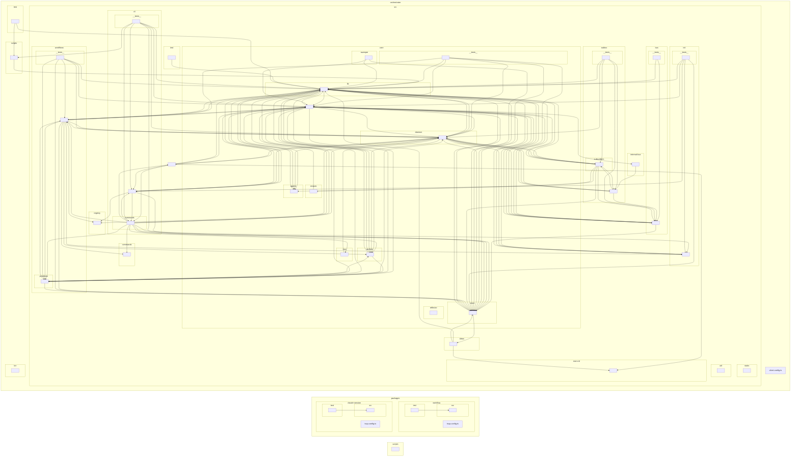

<!-- GENERATED by `npm run arch:graph` — do not edit by hand. -->
# Folder dependency graph — orchestrator + packages

Collapsed to folder granularity (`^(orchestrator/src/[^/]+/[^/]+/|orchestrator/src/[^/]+/|orchestrator/[^/]+/|packages/[^/]+/src/[^/]+/|packages/[^/]+/[^/]+/|scripts/)`).
1035 modules, 3434 dependencies.

