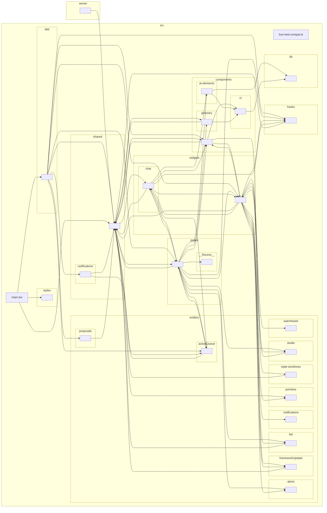

<!-- GENERATED by `npm run arch:graph` — do not edit by hand. -->
# Folder dependency graph — ui

Collapsed to folder granularity (`^(src/[^/]+/[^/]+/|src/[^/]+/|server/|scripts/)`).
324 modules, 751 dependencies.

